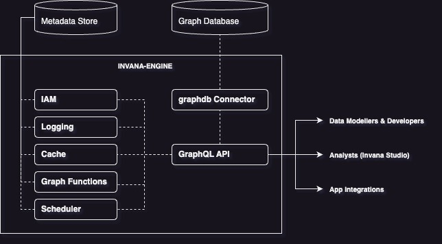

# What is Invana

Invana is a unified graph data and analytics platform. 

## Architecture

 

## Supported graph databases

| Database                                                                         | Gremlin            | Cypher             |
| ----------------------------------------------                                   | -------------------|--------------------|
| [Janusgraph](https://janusgraph.org)                                             | :material-check:   |  :material-close:  |
| [Azure Cosmos DB](https://cosmos.azure.com)                                      | :material-check:   |  :material-close:  |
| [Amazon Neptune](https://aws.amazon.com/neptune/)                                | :material-check:   |  :material-close:  |
| [DataStax Enterprise Graph](https://www.datastax.com/products/datastax-graph)    | :material-check:   |  :material-close:  |
| [ArcadeDB](https://arcadedb.com/)                                                | :material-check:   |  :material-check:  |
| [Neo4j](https://neo4j.com/)                                                      | :material-close:   |  :material-check:  |
 

!!! info Support for other graph databases
    Refer the [developers guide](./developers-guide/index.md) to add support for more graph databases 

<!-- ## License 

Apache 2.0 License -->

<!-- 
## Contents

1. Get started
    - Architecture
    - Connecting 
    - Graph backends
1. Connecting 
2. Modeling
    - 2.1 Defining Nodes & Relationships
    2.2 Defining properties (property types)
        2.2.1 
    2.3 Defining Relationships 
        2.3.1 Cardinality
        2.3.2 Relationship Uniqueness
        2.3.3 Defining Traversals
        2.3.4
    2.2 Contraints
        2.2.1 Creating contraints
        2.3.2 Removing contraints
        2.4.3 Checking status of contraints
        2.5.4 Reading contraints
    2.3 Indexes
        2.3.1 Creating indexes
        2.3.2 Removing indexes
        2.3.3 Checking status of indexes
        2.3.4 Reading indexes
3.   -->

