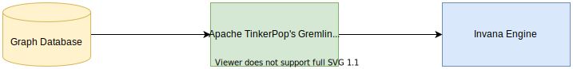

# Installing Invana Engine

Invana Engine connects to the Apache TinkerPop's Gremlin Server's for communicating with the Graph Database. Below is the simple representation of how Invana Engine connects to a Graph Database.



### Running using Docker

```
$ docker run -p 8200:8200 -d  -e GREMLIN_SERVER_URL=ws://xx.xx.xx.xx:8182/gremlin --name invana-engine invanalabs/invana-engine 
```

Invana Engine will be available at http://&lt;ip-address:8200&gt;. Following Docker environment variables are supported:

* **GREMLIN\_SERVER\_URL**: http or ws gremlin url. ex: ws://xx.xx.xx.xx:8182/gremlin or [http://xx.xx.xx.xx:8182/gremlin](http://xx.xx.xx.xx:8182/gremlin)
* **GREMLIN\_TRAVERSAL\_SOURCE**\(optional\): defaults: 'g'
* **GREMLIN\_SERVER\_USERNAME**\(optional\): gremlin username. ex: myusername
* **GREMLIN\_SERVER\_PASSWORD**\(optional\): gremlin password. ex: mypassword
* **SERVER\_PORT**\(optional, available in standalone python mode only\): port on which invana engine server is available: defaults to 8200


You can explore docker compose templates from [here](https://github.com/invanalabs/invana-engine/tree/develop/docker-templates) to deploy Invana Engine with Analytics Infrastructure with any of Invana supported Graph databases.


### Running using Python server \(standalone\)

```text
pip3 install invana-engine

export GREMLIN_SERVER_URL=ws://xx.xx.xx.xx:8182/gremlin
invana-engine-start
```


Running python server via this implementation is not designed for production setup. Please use docker for production deployments 


